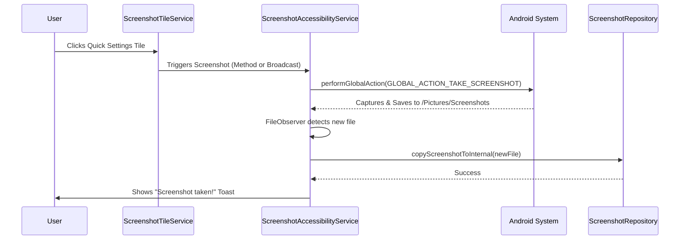

# Snapshort: System Architecture

This document provides a high-level overview of the Snapshort application's architecture and the interaction between its core components.

## Overview

Snapshort is a utility app designed for fast, non-interactive screenshot capture on Android. It leverages the **Accessibility Service** framework to perform system-level actions that would otherwise require complex permissions or user confirmation dialogs.

## High-Level Workflow

The following diagram illustrates the typical flow of a screenshot capture action:

## Core Components

### 1. [ScreenshotTileService](file:///d:/project/android/snapshort/app/src/main/java/com/example/snapshort/service/ScreenshotTileService.kt)
- **Role**: Entry point for the user via the Notification Shade.
- **Functionality**:
    - **State Management**: Uses `qsTile.state` (`STATE_ACTIVE` or `STATE_INACTIVE`) depending on whether `ScreenshotAccessibilityService.isServiceEnabled()` returns true.
    - **Active Tile Optimization**: Uses `ACTIVE_TILE` meta-data in manifest to allow the system to bind it more efficiently.
    - **Capture Trigger**: 
        1. Calls `collapseShade()` (using reflection on `StatusBarManager` or `collapsePanels` for newer APIs).
        2. Dispatches capture request via `ScreenshotAccessibilityService.takeScreenshot()` (direct instance call) AND a backup broadcast `com.example.snapshort.ACTION_TAKE_SCREENSHOT`.

### 2. [ScreenshotAccessibilityService](file:///d:/project/android/snapshort/app/src/main/java/com/example/snapshort/service/ScreenshotAccessibilityService.kt)
- **Role**: Privileged system interaction service.
- **Functionality**:
    - **Permission Check**: Maintains a static `instance` and `isServiceEnabled()` flag for other components to check readiness.
    - **Capture Logic**: Executes `performGlobalAction(GLOBAL_ACTION_TAKE_SCREENSHOT)`. This is preferred over `MediaProjection` as it avoids the "Start Recording" system dialog but requires Android 9 (Pie) or higher.
    - **File Discovery**: Uses `FileObserver` with `CREATE` or `CLOSE_WRITE` event masks. It watches both standard `/Pictures/Screenshots` and alternative `/DCIM/Screenshots` paths.
    - **Race Condition Handling**: Implements a `1000ms` delay before copying to ensure the system has finished flushing the captured image to disk.

### 3. [ScreenshotRepository](file:///d:/project/android/snapshort/app/src/main/java/com/example/snapshort/data/ScreenshotRepository.kt)
- **Role**: Data Access Layer and local storage manager.
- **Functionality**:
    - **Internal Scoping**: Uses `context.filesDir` to keep data private.
    - **Concurrency**: Implements `loadBitmap` with `Dispatchers.IO` to avoid blocking the main thread during image decoding.
    - **Naming Convention**: Files are saved as `screenshot_{timestamp}.png` to maintain uniqueness without complex database indexing.

### 4. [MainActivity](file:///d:/project/android/snapshort/app/src/main/java/com/example/snapshort/MainActivity.kt) & [GalleryScreen](file:///d:/project/android/snapshort/app/src/main/java/com/example/snapshort/ui/GalleryScreen.kt)
- **Role**: Presentation and management interface.
- **Functionality**:
    - **Lifecycle Awareness**: Uses `Lifecycle.repeatOnLifecycle(Lifecycle.State.RESUMED)` in `MainActivity` to refresh the screenshot list and permission status automatically when the user returns to the app.
    - **Modern UI Stack**: Built with Jetpack Compose, Material 3, and Coil for image loading.
    - **Gesture Engine**: `GalleryScreen` implements a custom `pointerInput` with `detectTransformGestures` for pinch-to-zoom (0.5x to 5x range) and panning in the full-screen viewer.

## Data Flow & Synchronization

Snapshort uses a "Pull-then-Sync" model:
1. The **System** captures the image and saves it to a public directory (e.g., `/Pictures/Screenshots`).
2. The **Accessibility Service**'s `FileObserver` detects this event.
3. The **Repository** copies the file to **Internal Storage**.
4. The **UI** (MainActivity) refreshes its local list from the internal storage via the repository.

This ensures that Snapshort has its own private gallery that remains consistent even if the user deletes images from the public gallery (or vice versa).
