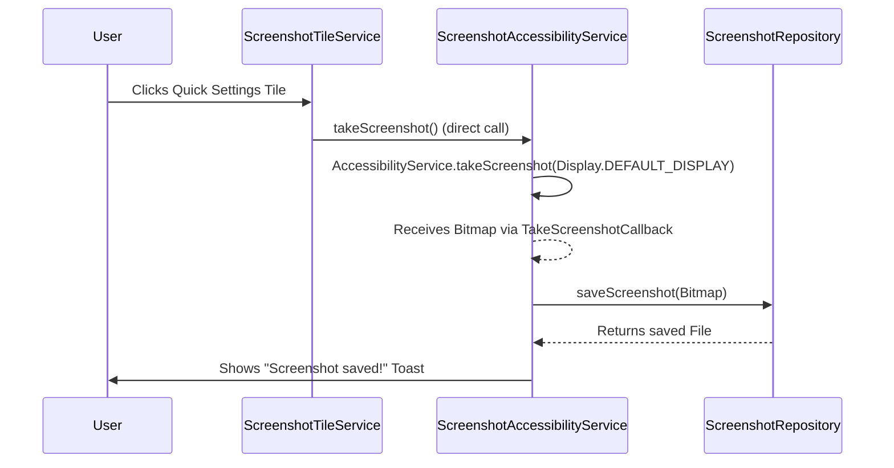

# Snapshort: System Architecture

This document provides a high-level overview of the Snapshort application's architecture and the interaction between its core components.

## Overview

Snapshort is a utility app designed for fast, non-interactive screenshot capture on Android. It leverages the **Accessibility Service** framework to perform system-level actions that would otherwise require complex permissions or user confirmation dialogs.

## High-Level Workflow

The following diagram illustrates the typical flow of a screenshot capture action:

> [!NOTE]  
> On Android 11+ (API 30), we use `AccessibilityService.takeScreenshot()` which returns a bitmap directly. On Android 9-10, we fall back to `performGlobalAction(GLOBAL_ACTION_TAKE_SCREENSHOT)`.

## Core Components

### 1. [ScreenshotTileService](file:///d:/project/android/snapshort/app/src/main/java/com/example/snapshort/service/ScreenshotTileService.kt)
- **Role**: Entry point for the user via the Notification Shade.
- **Functionality**:
    - **State Management**: Uses `qsTile.state` (`STATE_ACTIVE` or `STATE_INACTIVE`) depending on whether `ScreenshotAccessibilityService.isServiceEnabled()` returns true.
    - **Active Tile Optimization**: Uses `ACTIVE_TILE` meta-data in manifest for efficient binding.
    - **Capture Trigger**: Calls `ScreenshotAccessibilityService.takeScreenshot()` directly via static companion method.

### 2. [ScreenshotAccessibilityService](file:///d:/project/android/snapshort/app/src/main/java/com/example/snapshort/service/ScreenshotAccessibilityService.kt)
- **Role**: Privileged system interaction service.
- **Functionality**:
    - **Permission Check**: Maintains a static `instance` and `isServiceEnabled()` flag.
    - **Capture Logic (Android 11+)**: Uses `takeScreenshot(Display.DEFAULT_DISPLAY, executor, callback)` API which returns a `HardwareBuffer` containing the bitmap.
    - **Bitmap Processing**: Converts `HardwareBuffer` → `Bitmap` → saves to internal storage via `ScreenshotRepository`.
    - **Fallback (Android 9-10)**: Uses `performGlobalAction(GLOBAL_ACTION_TAKE_SCREENSHOT)` which saves to the system's public folder.

### 3. [ScreenshotRepository](file:///d:/project/android/snapshort/app/src/main/java/com/example/snapshort/data/ScreenshotRepository.kt)
- **Role**: Data Access Layer and local storage manager.
- **Functionality**:
    - **Direct Save**: `saveScreenshot(Bitmap)` compresses and saves PNG to internal storage.
    - **Internal Scoping**: Uses `context.filesDir` to keep data private.
    - **Concurrency**: Implements `loadBitmap` with `Dispatchers.IO`.
    - **Naming Convention**: Files use `screenshot_{timestamp}.png` format.

### 4. [MainActivity](file:///d:/project/android/snapshort/app/src/main/java/com/example/snapshort/MainActivity.kt) & [GalleryScreen](file:///d:/project/android/snapshort/app/src/main/java/com/example/snapshort/ui/GalleryScreen.kt)
- **Role**: Presentation and management interface.
- **Functionality**:
    - **Lifecycle Awareness**: Uses `Lifecycle.repeatOnLifecycle(Lifecycle.State.RESUMED)` to refresh automatically.
    - **Modern UI Stack**: Built with Jetpack Compose, Material 3, and Coil.
    - **Gesture Engine**: Pinch-to-zoom (0.5x to 5x) and panning in full-screen viewer.

## Data Flow

Snapshort uses a **Direct Capture** model on Android 11+:

1. User taps the Quick Settings tile
2. `TileService` calls `AccessibilityService.takeScreenshot()`
3. System returns `HardwareBuffer` → converted to `Bitmap`
4. `Repository` saves bitmap to **internal storage** directly
5. **No external storage access required** - images never touch public folders

This ensures complete privacy - screenshots are stored only in the app's private directory.
