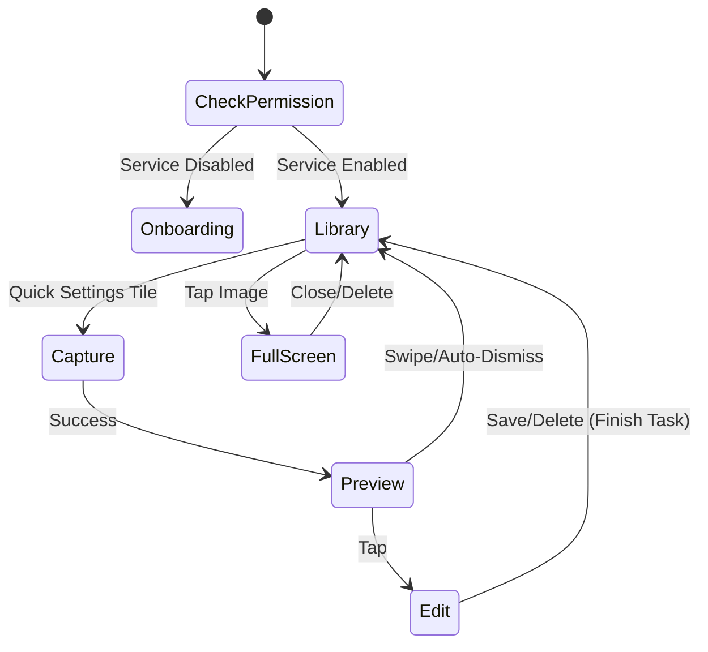

# Snapshort: User Interface & Flow

This document outlines the UI structure, Jetpack Compose implementation, and navigation flow.

## UI Overview

Snapshort uses **Jetpack Compose** with Material Design 3 for its entire UI.

## Main Screen Flow

The [MainActivity](file:///d:/project/android/snapshort/app/src/main/java/com/example/snapshort/MainActivity.kt) serves as the host for the application.

### 1. Permission State (Onboarding)
If the Accessibility Service is not enabled:
- Displays `AccessibilityPermissionScreen` with clear CTA
- Uses `LaunchedEffect` with `Lifecycle.State.RESUMED` to auto-check permission
- "Open Settings" button deep-links to system Accessibility settings

### 2. Preview State (Immediate)
Appears as a floating overlay after capture:
- **Auto-Dismiss**: Slides left after 2.5s inactivity
- **Swipe**: Manual dismiss (swipe left)
- **Tap**: Opens `EditScreenshotActivity`

### 3. Gallery State
Displays the `GalleryScreen`:
- **Refresh**: `PullToRefreshBox` for manual updates
- **Data Source**: `ScreenshotRepository.getScreenshots()` returns internal storage files
- **Auto-refresh**: List updates on every `onResume`

## Components
    
### [PreviewActivity](file:///d:/project/android/snapshort/app/src/main/java/com/example/snapshort/ui/PreviewActivity.kt)

| Feature | Implementation |
|---------|----------------|
| **Layout** | Transparent `Edge-to-Edge` Activity |
| **Animation** | `Animatable` offset + `LaunchedEffect` timer (2.5s) |
| **Gestures** | `detectHorizontalDragGestures` for swipe-to-dismiss |

### [EditScreenshotActivity](file:///d:/project/android/snapshort/app/src/main/java/com/example/snapshort/ui/EditScreenshotActivity.kt)

**Interaction Model: Create-Only**
- **Image**: Static/Frozen (No zoom)
- **Action**: "Drag-to-Crop" - dragging creates a *new* crop selection every time
- **Task**: Isolated stack (`taskAffinity=""`) so it doesn't clutter Main app history

### [GalleryScreen](file:///d:/project/android/snapshort/app/src/main/java/com/example/snapshort/ui/GalleryScreen.kt)

| Feature | Implementation |
|---------|----------------|
| **Grid Layout** | `LazyVerticalGrid` with 3 fixed columns, `4.dp` spacing |
| **Image Loading** | Coil `AsyncImage` with `crossfade(true)` |
| **Empty State** | Centered message when no screenshots exist |
| **Item Keys** | File `absolutePath` for efficient diffing |

### Full-Screen Viewer

Interactive image viewer with gesture controls:

```kotlin
Modifier
    .pointerInput(Unit) {
        detectTransformGestures { _, pan, zoom, _ ->
            scale = (scale * zoom).coerceIn(0.5f, 5f)
            if (scale > 1f) {
                offsetX += pan.x
                offsetY += pan.y
            } else {
                offsetX = 0f
                offsetY = 0f
            }
        }
    }
    .graphicsLayer(
        scaleX = scale,
        scaleY = scale,
        translationX = offsetX,
        translationY = offsetY
    )
```

| Gesture | Behavior |
|---------|----------|
| Pinch | Zoom 0.5x to 5.0x via `scale` state |
| Pan | Only when zoomed >1x, updates `offsetX/Y` |
| Reset | Auto-centers when zoom ≤1x |

- **Performance**: Uses `graphicsLayer` for GPU-accelerated transformations
- **Actions**: TopAppBar with Close and Delete buttons

## State Flow



## Lifecycle Integration

The UI reacts to app lifecycle events:
- **`RESUMED`**: Refreshes screenshot list and permission status
- **Pull-to-refresh**: Manual repository reload for edge cases
